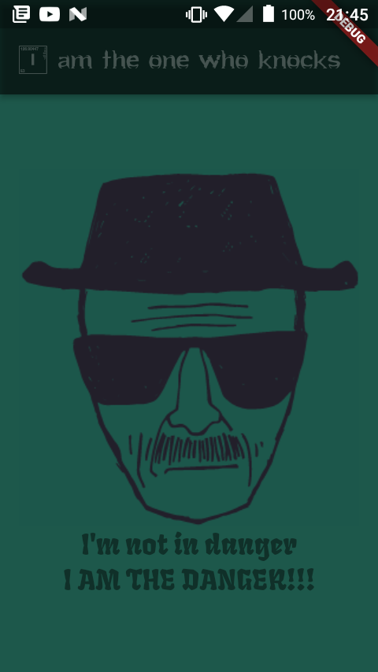

<h1  align="center">The one Who Knocks</h1>

  

Iniciando os meus estudos em flutter, fiz esse simples app para a assimilação inicial dos conceitos basicos de widgets e seus posicionamentos. Uma homenagem a minha seria favoria e uma das suas cenas mais iconicas.

  

<b> * Topicos estudados *

 - Conceitos iniciais do Flutter 
 - Conceitos inicias de Widgets e sua importância no Flutter 
 - Utilização de Imagens e configuração de dependências no pubspec.yaml 
 - Posicionamento básico de widgets

<h3> Tela do aplicativo em um celular MS50L Multilaser</h3>

